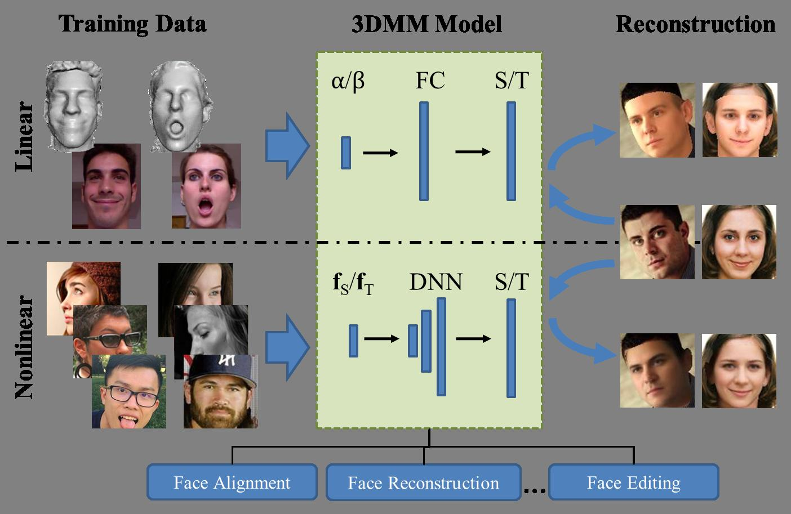

# Nonlinear 3D Face Morphable Model



## Library requirements

* Tensorflow


## Compile the rendering layer - CUDA code
```bash
$ # Compile
$ cd TF_newop/
$ ./compile_op_v2_sz224.sh
$ # Run an example
$ python rendering_example.py
```
Currently the code is working but not optimal (i.e see line 139 of TF_newop/cuda_op_kernel_v2_sz224.cu.cc)
also the image size is hard-coded. Any contribution is welcome!


## Citation

If you find this work useful, please cite our papers with the following bibtex:

```latex
@inproceedings{ tran2018nonlinear, 
  author = { Luan Tran and Xiaoming Liu },
  title = { Nonlinear 3D Face Morphable Model },
  booktitle = { IEEE Computer Vision and Pattern Recognition (CVPR) },
  address = { Salt Lake City, UT },
  month = { June },
  year = { 2018 },
}
```

## Contacts

If you have any questions, drop an email to _tranluan@msu.edu_ or leave a message below with GitHub (log-in is needed).
